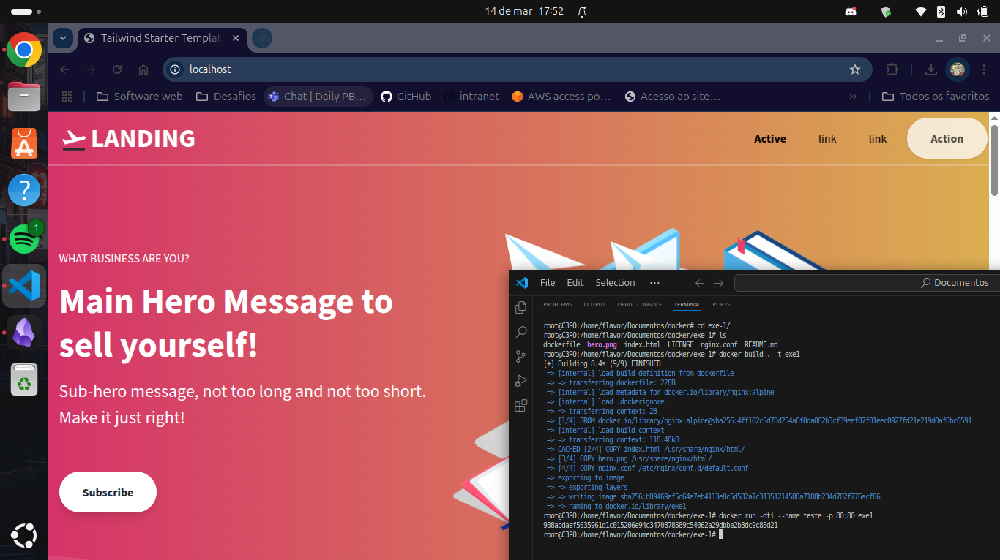
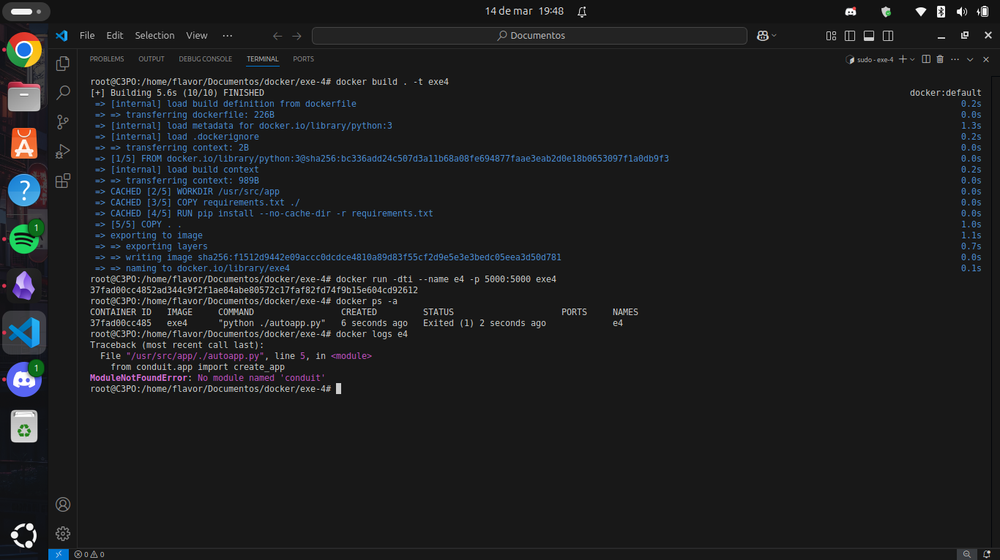

# Exem-docker
Aplicando todos os exemplos do desafio

**Exercícios Docker**

### 🟢 **Fácil**

1. **Rodando um container básico**
    - Execute um container usando a imagem do **Nginx** e acesse a página padrão no navegador.
    - 🔹 _Exemplo de aplicação:_ Use a [landing page do TailwindCSS](https://github.com/tailwindtoolbox/Landing-Page "https://github.com/tailwindtoolbox/landing-page") como site estático dentro do container.
    
**Flavor:**

- Criei uma pasta para o primeiro exercício  (exe1)
- Baixei o zip do TailwindCSS: https://github.com/tailwindtoolbox/Landing-Page/archive/master.zip
- Extrai o zip
- Criei um nginx.conf
- Criei um dockerfile

nano `nginx.conf`:

```
server {
    listen 80;
    server_name localhost;

    location / {
        root /usr/share/nginx/html;
        index index.html;
    }
}
```

nano `dockerfile`:

```
FROM nginx:alpine

COPY index.html /usr/share/nginx/html/
COPY hero.png /usr/share/nginx/html/
COPY nginx.conf /etc/nginx/conf.d/default.conf

EXPOSE 80

CMD ["nginx", "-g", "daemon off;"]
```

Resultado:



2. **Criando e rodando um container interativo**
    - Inicie um container **Ubuntu** e interaja com o terminal dele.
    - 🔹 _Exemplo de aplicação:_ Teste um script Bash que imprime logs do sistema ou instala pacotes de forma interativa.

**Flavor:**

Baixar uma imagem ubuntu com versão fixa no docker hub: https://hub.docker.com/_/ubuntu
- docker pull ubuntu:noble-20250127

Executar o container:
- docker run -dti --name nome-container ubuntu:noble-20250127
- docker exec -ti nome-container bash

Dentro do container:
- Atualizar a maquina (apt update && apt upgrade)
- Baixar o nano (apt install nano)
- Criar um arquivo.sh
- dar permissão de execução para ele(chmod +x arquivo.sh)
- Executar ele(./arquivo.sh)

nano `arquivo.sh`
```
#!/bin/bash

apt update
apt upgrade -y
apt autoremove -y
```

3. **Listando e removendo containers**
    - Liste todos os containers em execução e parados, pare um container em execução e remova um container específico.
    - 🔹 _Exemplo de aplicação:_ Gerenciar containers de testes criados para verificar configurações ou dependências.

**Flavor:**
 
- docker ps -a
- docker inspect nome-container
- docker stop nome-container
- docker rm nome-container

4. **Criando um Dockerfile para uma aplicação simples em Python**
    - Crie um `Dockerfile` para uma aplicação **Flask** que retorna uma mensagem ao acessar um endpoint.
    - 🔹 _Exemplo de aplicação:_ Use a API de exemplo [Flask Restful API Starter](https://github.com/gothinkster/flask-realworld-example-app "https://github.com/gothinkster/flask-realworld-example-app") para criar um endpoint de teste.

**Flavor**:

- Criar uma pasta para o exercício 4 (exe4)
- Baixar o zip:https://github.com/gothinkster/flask-realworld-example-app/archive/refs/heads/master.zip
- Extraia o conteúdo dele para a pasta do exercício
- Crie um requirements.txt de acordo com que a documentação do git pede
- Crie um dockerfile

nano `requirements.txt`:
```
# Everything needed in production

Werkzeug
SQLAlchemy==1.1.9
Flask_Caching
Flask_SQLAlchemy==2.2
click
marshmallow
Flask_Bcrypt
flask_apispec
Flask
PyJWT
Flask-JWT-Extended
unicode_slugify
psycopg2
Flask-Migrate
gunicorn
Flask-Cors
# Testing
pytest
WebTest
factory-boy
# For python 3
Faker
```

nano `dockerfile`:
```
FROM python:3

WORKDIR /usr/src/app

COPY requirements.txt ./

RUN pip install --no-cache-dir -r requirements.txt

COPY . .

ENV PYTHONPATH=/usr/src/app

CMD [ "python", "./autoapp.py" ]
```

Bem não consegui resolver o erro nem com ajuda dos geptos:




---

### 🟡 **Médio**

5. **Criando e utilizando volumes para persistência de dados**
    - Execute um container **MySQL** e configure um volume para armazenar os dados do banco de forma persistente.
    - 🔹 _Exemplo de aplicação:_ Use o sistema de login e cadastro do [Laravel Breeze](https://github.com/laravel/breeze "https://github.com/laravel/breeze"), que usa MySQL.


6. **Criando e rodando um container multi-stage**
    - Utilize um **multi-stage build** para otimizar uma aplicação **Go**, reduzindo o tamanho da imagem final.
    - 🔹 _Exemplo de aplicação:_ Compile e rode a API do [Go Fiber Example](https://github.com/gofiber/recipes/tree/main/docker-multistage-build "https://github.com/gofiber/recipes/tree/main/docker-multistage-build") dentro do container.
7. **Construindo uma rede Docker para comunicação entre containers**
    - Crie uma rede Docker personalizada e faça dois containers, um **Node.js** e um **MongoDB**, se comunicarem.
    - 🔹 _Exemplo de aplicação:_ Utilize o projeto [MEAN Todos](https://github.com/luanphandinh/mean-todo "https://github.com/luanphandinh/mean-todo") para criar um app de tarefas usando Node.js + MongoDB.
8. **Criando um compose file para rodar uma aplicação com banco de dados**
    - Utilize **Docker Compose** para configurar uma aplicação **Django** com um banco de dados **PostgreSQL**.
    - 🔹 _Exemplo de aplicação:_ Use o projeto [Django Polls App](https://github.com/databases-io/django-polls "https://github.com/databases-io/django-polls") para criar uma pesquisa de opinião integrada ao banco.

---

### 🔴 **Difícil**

9. **Criando uma imagem personalizada com um servidor web e arquivos estáticos**
    - Construa uma imagem baseada no **Nginx** ou **Apache**, adicionando um site HTML/CSS estático.
    - 🔹 _Exemplo de aplicação:_ Utilize a [landing page do Creative Tim](https://github.com/creativetimofficial/material-kit "https://github.com/creativetimofficial/material-kit") para criar uma página moderna hospedada no container.
